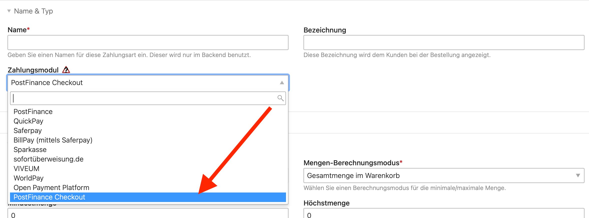

# PostFinance Checkout

[PostFinance Checkout][website] ist eine Online-Zahlungslösung der Schweizerischen PostFinance.

> Mit PostFinance Checkout erhalten Sie eine flexible und funktionsstarke Payment Service Providing Lösung für Ihren
> Onlineshop erweiterbar mit einem Zahlungsterminal für den stationären Verkauf. Zahlungsarten, Funktionen und Terminals 
> können gemäss Ihren Bedürfnissen konfiguriert werden.

Die Lösung bietet verschiedene Zahlungsmöglichkeiten, darunter Kreditkarten (VISA, MasterCard), PostFinance Card, 
PostFinance E-Finance und TWINT. Die Erweiterung für Isotope eCommerce unterstützt sowohl [_Checkout All-in-One_][all-in-one] als auch [_Checkout Flex_][flex].

## Einrichtung

Nach der Installation gemäss [Extension Store](https://extensions.terminal42.ch) steht die neue Zahlungsmethode im 
Isotope Backend zur Verfügung.

PostFinance Checkout bietet eine kostenlose Testversion, für welche man sich auf dem [Portal][portal] frei registrieren
kann. Mit dem Testkonto kann die volle Funktionalität in Isotope eCommerce getestet werden, erst nach Vertragsabschluss
werden tatsächliche Kosten berechnet und können echte Transaktionen durchgeführt werden.

[Weiterlesen](./einrichtung/)

[website]: https://www.postfinance.ch/de/unternehmen/produkte/einkassieren/onlineshop.html
[all-in-one]: https://www.postfinance.ch/de/unternehmen/produkte/einkassieren/onlineshop/e-payment-all-in-one.html
[flex]: https://www.postfinance.ch/de/unternehmen/produkte/einkassieren/onlineshop/e-payment-flex.html
[portal]: https://checkout.postfinance.ch
