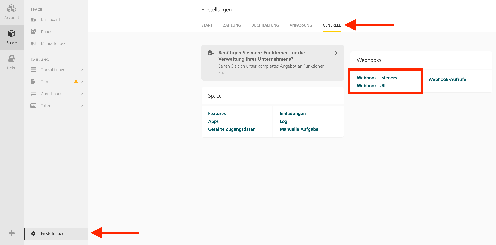
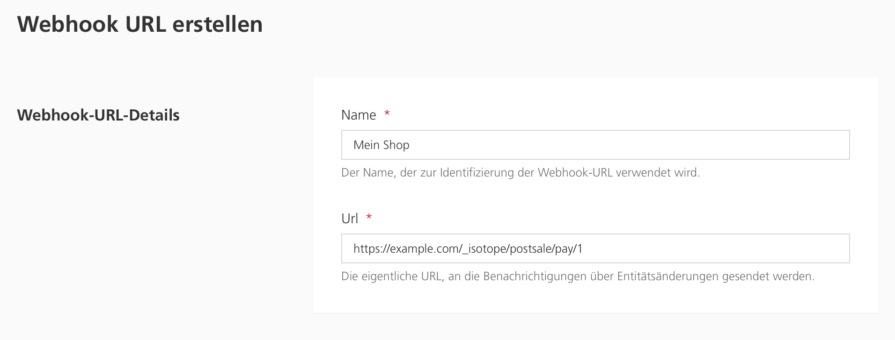
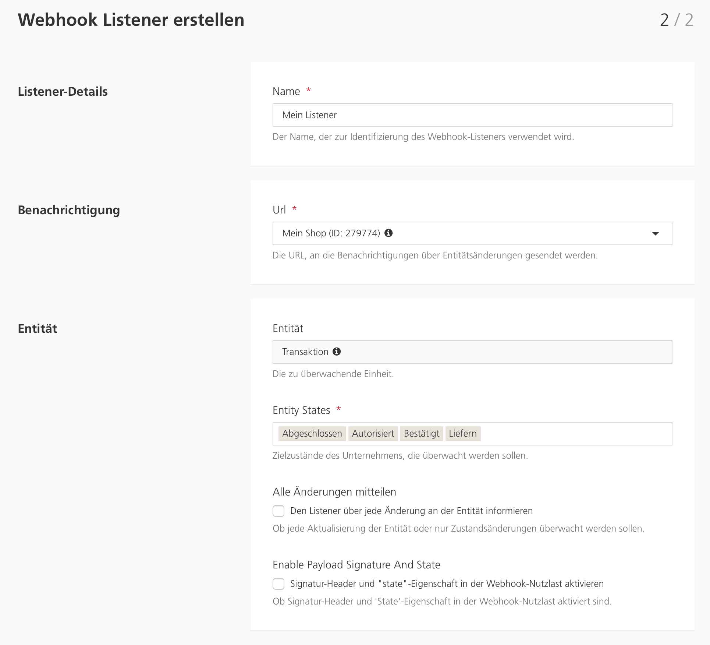

Um die Zuverlässigkeit der Zahlungsschnittstelle zu verbessern, sollten Webhooks für die 
Verarbeitung des Zahlungsstatus konfiguriert werden.

{}
**Für die Nutzung von Webhooks benötigtst du mindestens Version 1.0.0 der Erweiterung.**  
Beachte das Webhooks nicht auf lokalen Testsystemen funktionieren, oder wenn du 
deinen Shop mittels Passwort geschützt hast.
{}

Webhooks bestehen bei Postfinance Checkout aus einer **URL** uns einem oder mehreren **Listeners**.
Um diese einzurichten, navigiere im Portal in deinen Space und danach Links unten auf _Einstellungen_ und dann
in den Tabs auf _Generell_. Hier findest du die beiden nötigen Punkte.

## Webhook-URLs

Als Erstes musst du die URL deines Shops konfigurieren. Gehe dazu auf _Webhook-URLs_ und lege
einen neuen Datensatz an. Gibt einen Namen für deinen Shop und die URL zur Postsale-Schnittstelle von Isotope ein.
Die URL beginnt mit deiner Domain, die Zahl am Ende bezieht sich auf die Datenbank-ID der Zahlungsart.

{}
Die korrekte URL wird in deinem Shop-Backend angezeigt, wenn du die Zahlungsmethode bearbeitest.
{}

## Webhook-Listeners

Mit der _Webhook-URL_ weis Postfinance Checkout, unter welcher URL dein Shop informiert werden kann.
Nun müssen wir noch mitteilen, welche Informationen uns interessieren. Lege dazu einen **Webhook-Listener** an.

Wähle im ersten Schritt **Transaktion** als Entität. Im nächsten Schritt musst du dann die entsprechenden Felder 
ausfüllen. Gib dem Listener einen Namen, wähle die neue angelegte URL aus und selektiere mindestens 
die folgende drei _Entity States_:
- Autorisiert
- Abgeschlossen
- Liefern

## Testing

Leider lassen sich die Webhooks nicht direkt aus Postfinance testen. Du siehst aber, ob alles korrekt eingerichtet ist,
wenn du eine Testbestellung durchführst. Sobald diese abgeschlossen ist, sollte im Backend-Log von Contao ein Eintrag
beginnend mit `New post-sale request: …` zu sehen sein.
