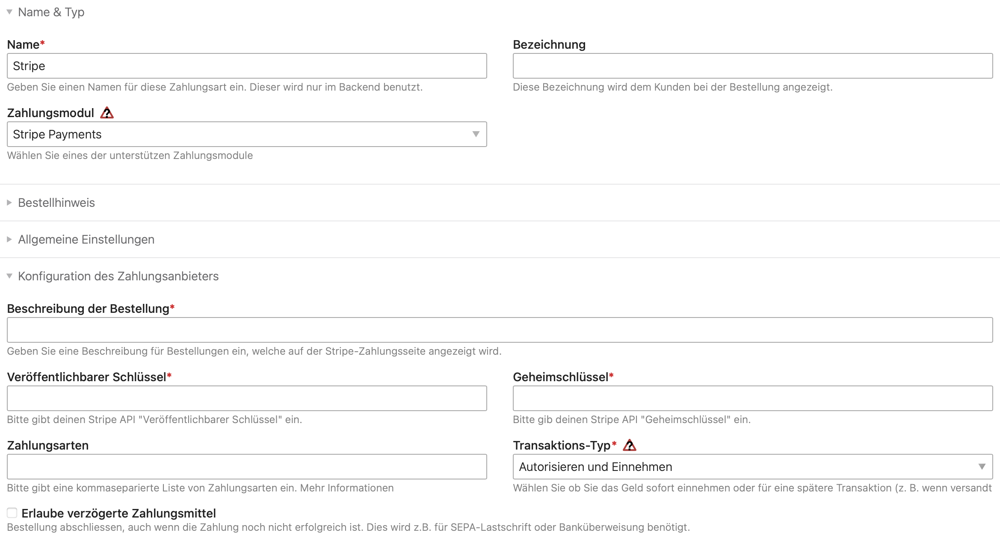

Nach erfolgreicher Installation der Erweiterung steht im Backend
von Isotope eCommerce eine neue Zahlungsart zur Verfügung. Diese
kann über den Punkt _Shop-Konfiguration_ => _Zahlungsarten_ eingerichtet werden.

## Einrichtung der Zugangsdaten

Für die Verbindung mit Stripe werden API-Zugangsdaten (öffentlicher und geheimer Schlüssel)
benötigt. Diese können im Stripe-Benutzerkonto unter _Developers_ gefunden werden.
Beide Schlüssel müssen ins Backend von Contao kopiert werden.

## Weitere Felder

### Beschreibung der Bestellung

Dieser Text wird bei Stripe angezeigt, wenn die Bestellung verarbeitet wird.
Gib z.B. deinen Shop-Namen oder "Bestellung von xxx" ein. Diese Zeile wird benötigt,
da Stripe keine negativen Produktdaten (Rabatte) darstellen kann.

### Zahlungsarten

> Stripe zeigt deinen Kunden/Kundinnen dynamisch die relevantesten Zahlungsmethoden an,
> basierend auf den im Dashboard festgelegten Präferenzen für die Zahlungsmethoden und 
> den Berechtigungsfaktoren wie Transaktionsbetrag, Währung und Zahlungsfluss.  
> – [Stripe Dokumentation](https://docs.stripe.com/payments/payment-methods/integration-options#using-dynamic-payment-methods)

Im Feld _Zahlungsarten_ kann eine kommaseparierte Liste von Zahlungsmethoden eingegeben werden,
falls nicht automatisch alle angeboten werden sollen. Siehe dazu die [Liste der möglichen Werte](https://docs.stripe.com/api/payment_methods/object#payment_method_object-type).

### Transaktions-Typ

Hier kann gesteuert werden, ob Zahlungen z.B. bei Kreditkarten automatisch belastet
oder nur reserviert werden. Im Normalfall ist "Authorisieren und Einnehmen" die sinnvollere Option.

### Erlaube verzögerte Zahlungsmittel

Standardmässig werden Bestellungen in Isotope nur abgeschlossen, wenn die Zahlung erfolgreich ist,
z.B. wenn die Kreditkarte erfolgreich belastet werden konnte. Stripe unterstützt allerdings auch
Zahlungsmittel, welche erst verzögert erfolgreich sind. Dazu gehören zum Beispiel _SEPA-Lastschrift_
oder _Banküberweisung_.

Wird die entsprechende Option aktiviert, prüft die Zahlungsmethode nicht mehr auf Erfolg der Zahlung.
Die Bestellung wird sofort abgeschlossen, ob die Bestellung versendet werden soll, muss manuell geprüft werden.

{}
Wenn verzögerte Zahlungsmittel verwendet werden, sollte ein Bestellstatus gewählt werden,
der nicht sofort als _bezahlt_ gilt. Ansonsten ist es möglich, z.B. digitale Artikel wie PDFs herunterzuladen,
bevor die Zahlung tatsächlich erfolgreich ist.
{}
