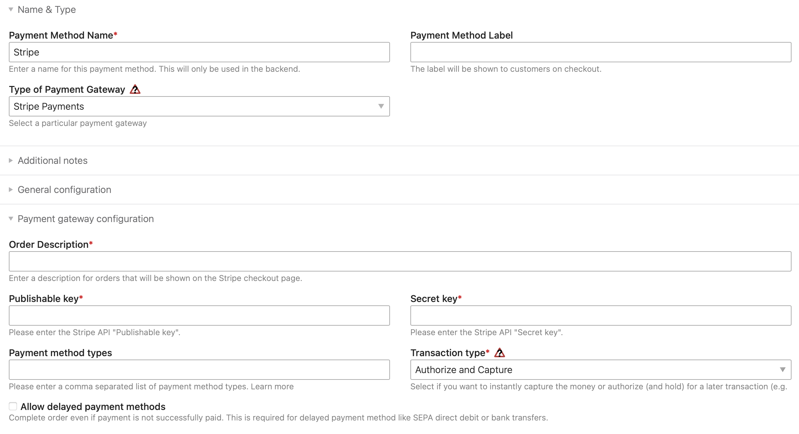
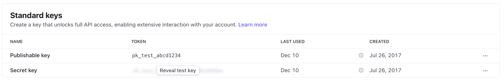

After successfully installing the extension, a new payment method will appear in the backend
of Isotope eCommerce. It can be set up by selecting _Store configuration_ => _Payment methods_.

## Setting up the access details

API access credentials (publishable and secret key) are required for the connection with Stripe.
These can be found in the Stripe user account under _Developers_. Both keys must be copied into the Contao backend.

## Other fields

### Order Description

This text is displayed by Stripe in the payment processing screen.
Enter your store name or "Order from xxx" for example. Unfortunately, this line
is required, as Stripe cannot display negative product amounts (discounts).

### Payment method types

> Stripe dynamically displays the most relevant payment methods to your customers based on the payment method 
> preferences you set in the Dashboard and eligibility factors such as transaction amount, currency, and payment flow.  
> – [Stripe documentation](https://docs.stripe.com/payments/payment-methods/integration-options#using-dynamic-payment-methods)

A comma-separated list of payment methods can be entered in the _Payment method types_ field,
if not all of them are to be offered automatically. 
See the [list of possible values](https://docs.stripe.com/api/payment_methods/object#payment_method_object-type).

### Transaction type

Here you can control whether payments, e.g. for credit cards, are automatically debited
or only reserved. Normally, "Authorize and collect" is the more sensible option.

### Allow delayed payment methods

By default, orders in Isotope are only completed if the payment is successful,
e.g. when the credit card has been successfully charged. However, Stripe also supports
payment methods that are only successful after a delay. These include _SEPA direct debit_
or _bank transfer_ and others.

If the option is activated, the payment method no longer checks whether the payment was successful.
The order is completed immediately, whether the order should be sent must be checked manually.

{}
If delayed means of payment are used, an order status should be selected that is not immediately considered _paid_.
Otherwise, it might be possible to download digital items such as PDFs
before the payment is actually successful.
{}
