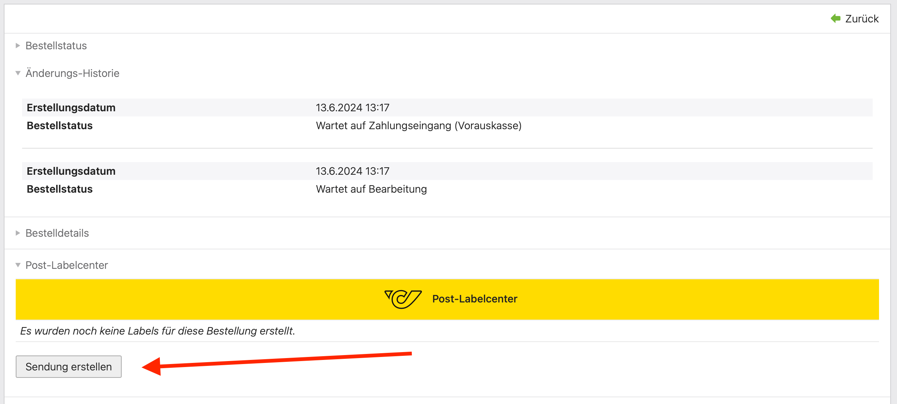
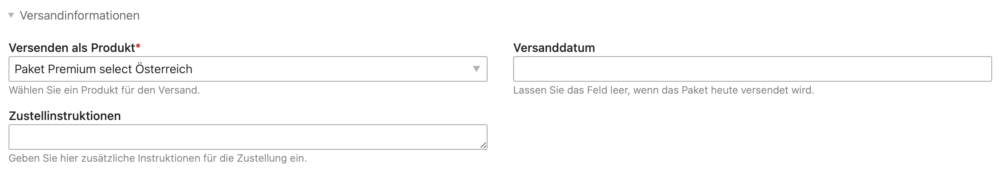
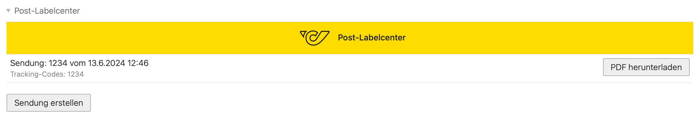

# Post-Labelcenter 

Mit Hilfe der Versandsoftware [**Post-Labelcenter**][PLC] erstellst du rasch und gemäß den Anforderungen der Post
deine Paketaufkleber, Sendungslisten und die dazu notwendigen Avisodaten für eine optimale logistische Abwicklung.

## Integration in Isotope eCommerce

Mit der Erweiterung für Isotope eCommerce lassen sich Paketaufkleber für Bestellungen direkt aus dem
Backend von Contao erstellen. Vorteil der Integration ist, dass die Absender- und
Empfängeradresse sowie weitere Paketinformationen automatisch aus der Bestellung ausgelesen
und an die Österreichische Post übermittelt werden.

## Sendung erstellen

Durch Klick auf «Sendung erstellen» öffnet sich die Konfigurationsmaske des Post-Labelcenter.
Hier gibt es folgende Bereiche:

1. **Absender:in**

   Die Absenderadresse des Shops wird automatisch aus der Shop-Konfiguration übernommen.

2. **Empfänger:in**

   Auch die Empfängeradresse wird automatisch übernommen. Falls vorhanden zuerst die Versandadresse,
   andernfalls die Rechnungsadresse der Bestellung.

   {}
   Bei internationalen Sendungen ist die Angabe einer E-Mail-Adresse oder Telefonnummer zwingend.
   Falls dies in der Bestellung fehlt, muss das Feld beim Erstellen der Sendung ausgefüllt werden. 
   {}

3. **Versandinformationen**

    In diesem Bereich lässt sich das gewünschte Produkt der Post wählen. Je nach [Konfiguration](./settings/)
    wird bereits automatisch das bevorzugte Produkt vorausgewählt. Die verfügbaren Optionen sind
    abhängig vom Vertrag mit der Österreichischen Post.

    

4. **Zusatzleistungen**

   Erlaubt die Erfassung von zusätzlichen Leistungen für eine Sendung. Siehe [Zusatzleistungen](../features/).

5. **Packstücke**

   Erlaubt die Erfassung von mehreren Paketen für eine Sendung. Siehe [Mehrere Pakete](../parcels/).

6. **Artikel**

   Für eine Zollabwicklung (Versand ins Ausland) müssen die Artikel in den Paketen deklariert werden.
   Siehe [Internationaler Versand](../international/).

[PLC]: https://www.post.at/g/c/paket-versandsoftware-geschaeftlich

## Etikett drucken

{}
Sobald die Sendung bei der Post angemeldet ist, kann diese nicht mehr bearbeitet werden!
{}

Durch Klick auf _Etiketten drucken und speichern_ wird die Sendung bei der Post angemeldet. Wurde kein abweichendes
Versanddatum unter _Versandinformationen_ konfiguriert, erwartet die Post, dass das Paket umgehend übergeben wird.

Um die eingegebenen Daten nur zu speichern, kann die Aktion _Entwurf speichern_ genutzt werden.

Entwürfe und angemeldete Sendungen werden in der Bestellung im Backend von Contao aufgelistet. 
Hier lassen sich auch die Etiketten für den Versand herunterladen.

