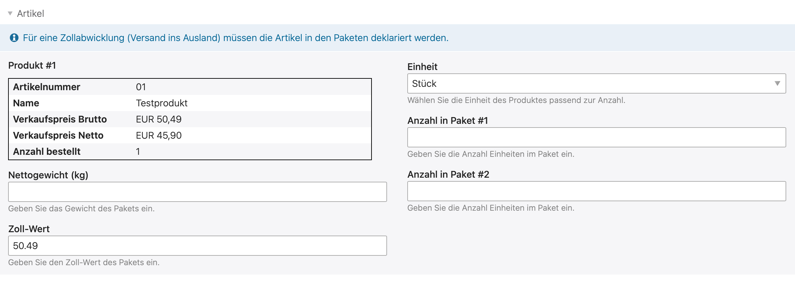

Bei internationalem Versand müssen die Artikel in den Paketen für die Zollabwicklung deklariert werden.
Auch hier bietet die Integration in Contao eine grosse Hilfe, da die Artikeldaten automatisch übernommen werden.

Ist beim Produkt ein Gewicht eingetragen, wird dies automatisch übernommen. Wurden für die Sendung mehrere
Pakete angelegt, muss pro Paket die enthaltene Anzahl des Produkts eingegeben werden. Optional lässt sich der Zollwert
korrigieren, sollte er nicht dem Verkaufspreis des Produktes entsprechend.

{}
Sollte sich das Produkt nicht in einem Paket befinden, muss `0` bei Anzahl eingetragen werden.
{}
