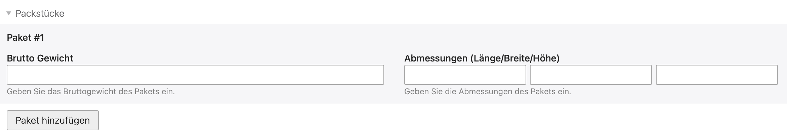

Kann eine Bestellung nicht in einem Paket versendet werden, gibt es zwei Möglichkeiten:

1. Die Aktion _Sendung erstellen_ kann beliebig oft ausgeführt werden, um eine weitere Sendung zur Bestellung hinzuzufügen.
   Das ist beispielsweise sinnvoll, wenn nicht alle Artikel gleichzeitig lieferbar sind, oder verschiedene Zusatzleistungen
   für die Pakete gebucht werden sollen.

2. Innerhalb einer Sendung können auch mehrere Pakete bei der Post angemeldet werden. Der Versand dieser Pakete
   erfolgt dann in der Regel gleichzeitig.
   

{}
Bei mehreren Paketen ist unbedingt auf das Brutto-Gewicht zu achten. Wurde in den Produktdaten ein Gewicht eingetragen,
steht in diesem Feld automatisch das Total aller Artikel! Der Wert muss also entsprechend dem Paketinhalt korrigiert werden.
{}
