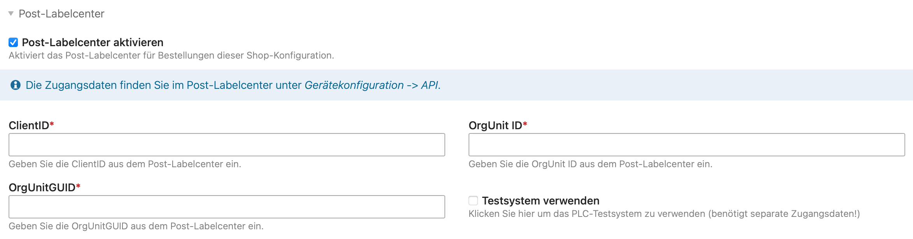
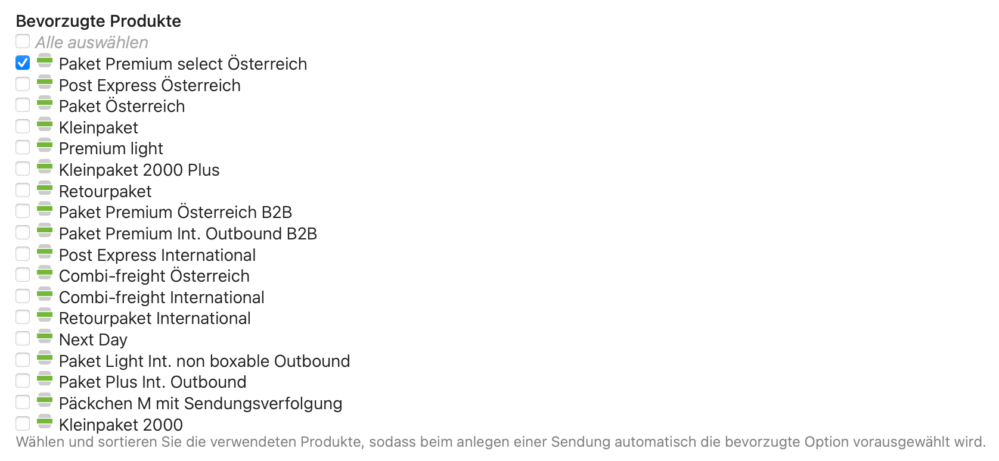

Nach der Installation der Erweiterung muss eine Verbindung zum Post-Labelcenter hergestellt werden.
Die Konfiguration dazu erfolgt in der jeweiligen Shop-Konfiguration. Die benötigten Zugangsdaten findest du im
Backend des Post-Labelcenters unter _Gerätekonfiguration_, dann _API_.

## Bevorzugte Produkte

In der Shop-Konfiguration kann auch eine Reihenfolge der _bevorzugten Produkte_ konfiguriert werden.
Bei der Übermittlung der Paketdaten an die Post versucht Isotope dann, automatisch das beste passende Paket
zu wählen. Die verfügbaren Optionen sind ggf. abhängig vom Vertrag mit der Post, die tatsächlich verfügbaren
Optionen werden jeweils pro Bestellung neu berechnet (z.B. je nach Zielland).

